## justarandomgeek's Combinator Computer Mk5

[ (Click to Embiggen - 75MB)](http://static.justarandomgeek.com/factorio/WelcomeToTheMachine.png)

This is a programmable computer constructed entirely of vanilla combinator logic, with some mods for peripherals (Notably, Pushbuttons and Nixie Tubes everywhere for IO devices, and Color Coding for clarity). The machine has a set of registers which can be used directly in operations, and a shared memory bus for RAM, ROM, and memory-mapped devices. These registers and memories all store circuit-frames, sets of signal/value pairs. There is no system-wide clock, the machine runs by passing a pulse around in cycles - each instruction returns the pulse to the Instruction Fetch block to be sent out again to the next instruction. The machine is programmed in not-quite-lua, or nql, which has a syntax mostly based on Lua, with a few 'borrows' from other languages (mostly C) where required.

### Main Bus Signals
  Major signals are carried along a 12-pole Main Bus, and labeled with floor concrete. In general pairs will be kept together for single-color poles, but when a pole must carry mixed pairs, the left side is colored for the green wire, and the right side for red wire.

  The bus is constructed from the [Bus H](blueprints/Bus H.txt) and [Bus V](blueprints/Bus V.txt) blueprints. The fire hazard concrete should be bottom-right.

| Pole Color | Green Wire | Red Wire |
|------------|------------|----------|
| Red        |                               | rKeyboard            |
| Orange     | Op Pulse                      | rStatus              |
| Yellow     | Op                            | To PC                |
| Green      | R1                            | Scalars              |
| Cyan       | R2                            | Vector Result        |
| Blue       | Scalar Result (`signal-grey`) | rIndex               |
| Purple     | Memory Read Request           | Memory Read Response |
| Magenta    |                               | Memory Write         |
| White      | NixieTerm                     | NixieTerm            |
| Hazard     | IO Wire                       | IO Wire              |
| FireHazard | IO Wire Register              | IO Wire Register     |

  * Scalars
    * signal-grey: R1.s1
    * signal-white: R2.s2
    * signal-I: rIndex.index
  * To PC
    * signal-blue: next
    * signal-green: rjmp to signal-grey
    * signal-red: jump to signal-grey
    * signal-pink: execute this frame as an instruction
    * signal-yellow: Hold. Prevents execution of instructions while set.
    * signal-cyan: Interrupt. Next update (except exec) will save return site in rStatus and jump to interrupt vector.
  * rStatus
    * signal-blue: PC
    * signal-green: Interrupt Return site
    * signal-cyan: Interrupt Request
    * signal-I: Interrupt Enable

### ScalarGen and Scalar Pick & Return
  The Scalar Pick & Return mechanism allows operating on individual signals from registers. There are two Pick channels, s1 and s2, and one Return channel sd, selected by the corresponding signals in the current opcode, and operating on the corresponding register selection. Because the signals available will vary depending on what mods are installed, this module is generated by a script, ScalarGen. ScalarGen is executed by pasting it into Foreman's import window as if it were a blueprint string, and will add a blueprint named ScalarGen to your list. It will also produce a file `scalarmap.lua` in your script-output directory listing the numeric mappings for the assembly it has generated, which must be used when compiling programs for your computer. The local bus generated by ScalarGen is, from left to right, Blue,Yellow,Cyan,Green.

### Registers
  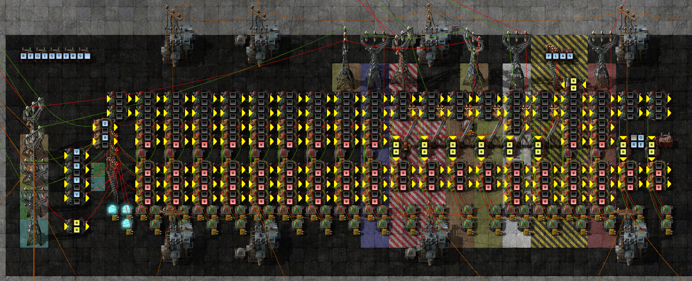

  Registers store an entire circuit network frame, except `signal-black`. `signal-black` is used internally for various scalar and flag values throughout the machine, and cannot be stored in registers/memory, or expressed correctly in most mechanisms. General Purpose registers start at 1, IO/Special registers start at 101.

  

| ID     | Name          | Callee Saved | Purpose |
|--------|---------------|--------------|---------|
| <0     |               |No  | Reserved for future use |
| 0      | `rNull`      |No  | No Register selected Returns 0 on every signal |
| 1      | `rGlobalInts`|Yes | Global Integers |
| 2      | `rLocalInts` |Yes | Local Integers |
| 3      | `rScatchInts`|No  | Int Temporaries |
| 4-5    | `rFetch[1-2]`|No  | Fetch space for non-register inputs |
| 6-9    | `rArg[1-4]`  |No  | Function Arguments. |
| 10     | `rIntArgs`   |No  | Int args Return site on `signal-0` |
| 11-15  | `rTemp[1-5]` |No  | Temporaries |
| 16-20  | `rSTemp[1-5]`|Yes | Saved Temporaries |
| 21-25  | `r21`-`r25`  |Yes | Reserved for OS/ISR use |
| 26-100 |               |    | Reserved for future use |
| 101    | `rIndex`     |Yes* | Indexing regiser Supports auto-indexing memory operations. |
| 102    | `rRed`       |No  | IO Wire Red data since list transmitted |
| 103    | `rGreen`     |No  | IO Wire Green data since last transmitted |
| 104    | `rStatus`    |No  | CPU Status register |
| 105    | `rOp`        |No  | Current Op data |
| 106    | `rNixie`     |No  | NixieTerm |
| 107    | `rKeyboard` |No| Keyboard interface Reads a whole string  |
| 108    | `rResearch` |No| Research Combinator Reads current research information |
| 109+   | `r109`+      |No| IO Expansion ports Additional devices may be connected to these registers |

Calling Convention:

  * Caller:
    * Save temporaries if used locally
      * Push rTemp1-5
      * Push rArgs1-5
    * Arrange Function args
      * Tables in rArg[1-4], then on stack
      * Ints in rIntArgs (own from stack if required)
    * Longcall: update pointers
      * Push rIndex
      * VReplace rIndex {newframe}
    * Jump to function / callsite to rIntArgs.signal-0
  * Callee:
    * Save registers before local use
      * Push rLocalInts
      * Push rSTemp1-5
    * [Function Body]
    * Arrange returns
      * Ints in rScratchInts
      * Tables in rFetch1-2
    * Restore registers
      * Pop rSTemp5-1
      * Pop rLocalInts
    * Jump to rIntArgs.signal-0
  * Caller (on return):
    * LongCall: restore pointers
      * Pop rIndex
    * Assign Return values
      * but regs not restored?
        * tables - skip restore and copy these?
        * copy to rScratchInts/rFetch1-2
        * any avialable rTemp too
    * Remove stacked args if any
      * Pop rNull or just callstack+=n
    * Restore Temporaries
      * Pop rArgs5-1
      * Pop rTemp5-1

### Memory
  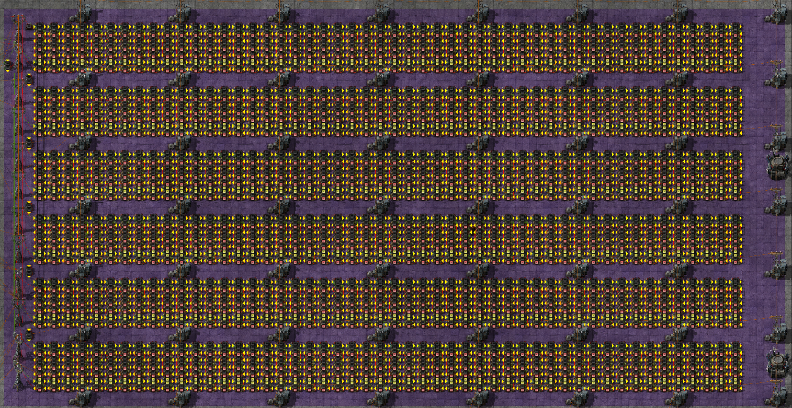

  The memory is a large array of identical storage cells. To write a cell, send the address on `signal-black` combined with the data on the global Memory Write wire. To read a cell, send the address on `signal-black` on the Memory Read Request wire, and receive a response the following tick on Memory Read Reply containing data+address.

### Instruction Fetch

  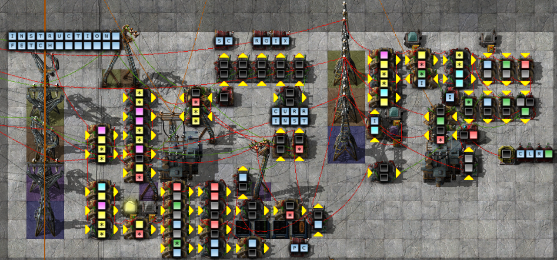

  This block recieves the PC Update frames produced by other blocks and acts on them. It performs the following actions:
   * Update PC
   * Fetch the instruction specified, and post it to the global Op wire
   * Wait for signals to stabilize
      1. <none>
      2. Scalar `signal-I` from rIndex, if selected
      3. R1 and R2 selected for operation
      4. <none>
      5. R1.S1 and R2.S2 selected for operation
   * Send a pulse to the global Op Pulse wire to trigger an instruction block

  In the case of an Exec command, instead of fetching a frame from memory, the command itself will be used.

  When interrupts are enabled (using a jmp instruction with `signal-cyan` set), this block also handles jumping to the interrupt vector when an interrupt is triggered, signalled by raising `signal-cyan` on the To PC wire. When an interrupt is caught, the next value of PC is calculated, stored in rStatus.intreturn, and then execution jumps to rIndex.intvect to handle the interrupt.

### NixieTerm
  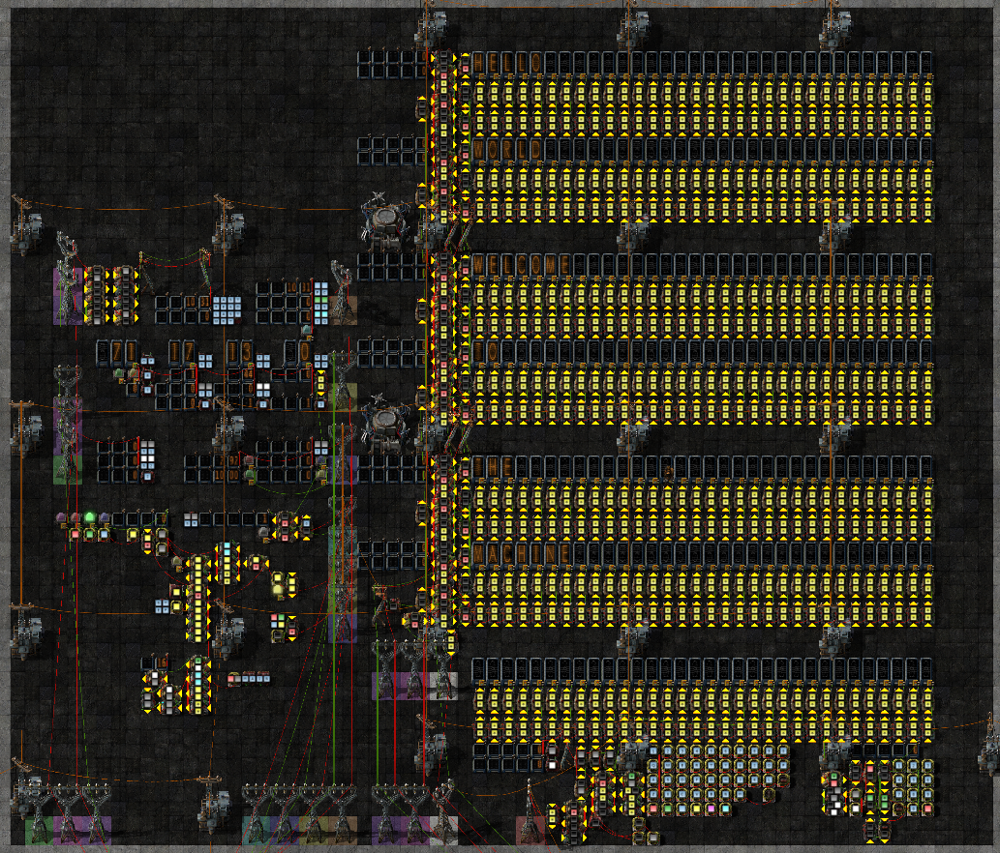

  NixieTerm is a multi-line Alpha Nixie display. It can be accessed as an array of bit-packed strings in memory starting at 900, or the lowermost row can be accessed as a `rNixie`, and shifted upward.

  Any signals written in register mode will be added to the sum for the lowermost row. Clearing the register will shift all rows upward and clear the lower row.

  Two numeric displays are provided beside each row, showing `signal-grey`(top) and `signal-white`(bottom) of the corresponding cell.

  NixieTerm supports all the characters supported by the Alpha Nixie:
  * A-Z0-9 as their correspnding signals
  * The symbol signals provided by Nixie Tubes

  Color signals may be bit-packed along with characters.

### Operations
  The following signals are used to select registers and signals:

| Signal   | Purpose |
|----------|---------|
| signal-0 | Op      |
| signal-A | Accumulate |
| signal-I | Index/Stack Select |
| signal-R | R1 |
| signal-S | S1 |
| signal-T | R2 |
| signal-U | S2 |
| signal-V | Rd |
| signal-W | Sd |
| signal-grey | Imm1 |
| signal-white | Imm2 |

  If Rd is set, the selected register will be cleared as Op Pulse is triggered unless Accumulate is also set (>0), even if the current operation does not actually assign to it. The whole register will be cleared, even in scalar operations.

  For operations which support memory indexing, the base pointers are selected as follows:

|  I  |Signal         | Usage      |
|-----|---------------|------------|
|  1  |`signal-red`   | Call Stack |
|  2  |`signal-green` | Current Program Constant/Code Frame |
|  3  |`signal-blue`  | Current Progarm Data Frame |
|  4  |`signal-yellow`| local usage |

  Individual instructions may also define additional signals. Any unused signals should be left unset.

  Potential future expansion - more indexes, maybe PC,

### Memory Layout

* Reserved/Unsupported - <0
* Null - 0
* RAM - 1-600
  * slices allocated to programs as needed
* \<gap>
* NixieTerm 900+nlines
* \<gap>
* ROMS 1000-?

Programs:
  * Program symbol [1]
    * Program name, size of other sections
  * Symbol table [n]
    * Symbol name/type/address/size
  * (?) Extern links
  * Constants [n]
  * Code [n]

#### 0: Halt
  Any undefined opcode will halt the machine, but Op=0 is specifically reserved for doing so.

#### 1-60: Basic ALU
  mk5alu:

  ALU in several blocks

Comparators

  Compare modes (??) selected by:
  * Signal-1 : =
  * Signal-2 : <
  * Signal-3 : >
 
  1.  R1.Each ?? R2.S2 ::> 1 -> Rd.Sd
  2.  R1.Each ?? R2.S2 ::> R1:1 => Rd
  3.  R1.Each ?? R2.S2 ::> R1 => Rd  
  4.  R1.Every ?? R2.S2 ::> 1 -> Rd.Sd
  5.  R1.Every ?? R2.S2 ::> R1:1 => Rd
  6.  R1.Every ?? R2.S2 ::> R1 => Rd
  7.  R1.Any ?? R2.S2 ::> 1 -> Rd.Sd
  8.  R1.Any ?? R2.S2 ::> R1:1 => Rd
  9.  R1.Any ?? R2.S2 ::> R1 => Rd
  10. R1.S1 ?? R2.S2 ::> 1 -> Rd.Sd
  11. R1.S1 ?? R2.S2 ::> R1:1 => Rd
  12. R1.S1 ?? R2.S2 ::> R1 => Rd
  
Each [arith] Scalar => Vector 

  17. R1.Each - R2.S2 => Rd
  18. R1.Each + R2.S2 => Rd
  19. R1.Each / R2.S2 => Rd
  20. R1.Each * R2.S2 => Rd
  21. R1.Each % R2.S2 => Rd
  22. R1.Each & R2.S2 => Rd
  23. R1.Each | R2.S2 => Rd
  24. R1.Each xor R2.S2 => Rd
  25. R1.Each pow R2.S2 => Rd  
  26. R1.Each << R2.S2 => Rd
  27. R1.Each >> R2.S2 => Rd

Scalar [arith] Scalar -> Scalar

  39. R1.S1 - R2.S2 -> Rd.Sd
  40. R1.S1 + R2.S2 -> Rd.Sd
  41. R1.S1 / R2.S2 -> Rd.Sd
  42. R1.S1 * R2.S2 -> Rd.Sd
  43. R1.S1 % R2.S2 -> Rd.Sd
  44. R1.S1 & R2.S2 -> Rd.Sd
  45. R1.S1 | R2.S2 -> Rd.Sd
  46. R1.S1 xor R2.S2 -> Rd.Sd
  47. R1.S1 pow R2.S2 -> Rd.Sd
  48. R1.S1 << R2.S2 -> Rd.Sd
  49. R1.S1 >> R2.S2 -> Rd.Sd

#### 61-62 Vector ALU

  This block is generated by MaskGen. The local bus generated by MaskGen is, from left to right, Orange,Cyan,Green.

  The Pairwise ALU block is generated by a script to allow working with all signals in the current game. This block performs pairwise Multiply/Divide operations on the operands and returns the result to Vector Result. This block is optional and if not installed Ops 61 and 62 will halt the machine.

  * 61: R1.each * R2.each => Rd
    * x y = ((x + y)^2 - (x - y)^2)/4
    * x y = ((x + y)^2)/4 + ((x - y)^2)/-4
    * 
  * 62: R1.each / R2.each  => Rd

#### 63-64 Scalar Array (exec)
  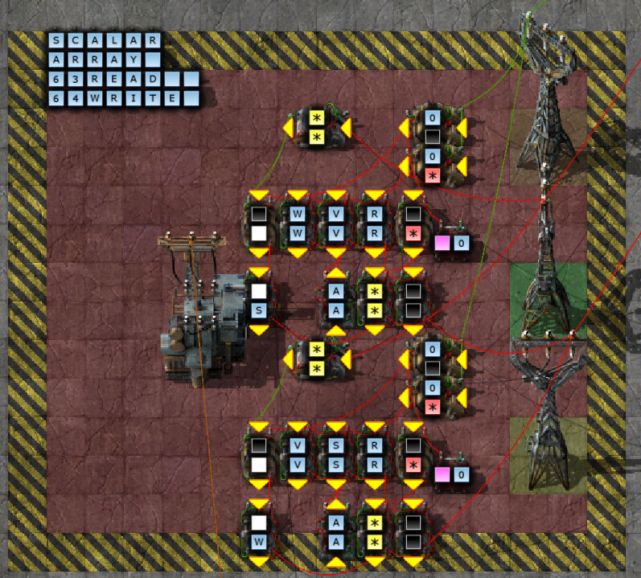
  * 63: Pick
    * R1.[R2.s2] -> Rd.sd
      * exec{0=58,R=R,S=[R2.s2],V=V,W=W,A=A}
  * 64: Write
    * R1.s1 -> Rd.[R2.s2]
      * exec{0=58,R=R,S=S,V=V,W=[R2.s2],A=A}

#### 65: Scalar shift up (not yet implemented)
  R1 >> R2.s2 => Rd

#### 66: Scalar shift down (not yet implemented)
  R1 << R2.s2 => Rd

#### 67: Vector Replace/Mask
  
  R1 is passed through except:
  * positive values in R2 replace the values in R1
  * negative values in R2 clear the signal

#### 68: String Length
  max(log2(R1)) -> Rd.Sd
  log2() treats input values as unsigned, so log2(negative)=32

#### 69: int to string (not yet implemented)

#### 70: Jump
  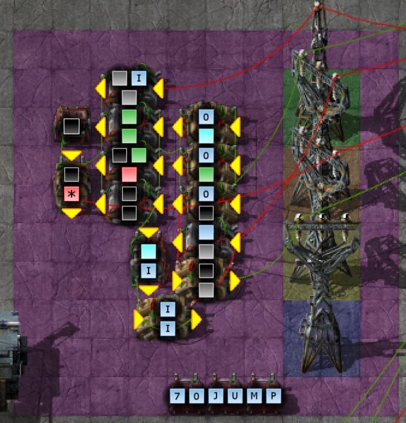

  Jump to R1.s1 if `signal-green`=0 or PC+R1.s1 if `signal-green`=1. Return PC+1 to Rd.Sd. If `signal-cyan` is set, enable(1)/disable(-1) interrupts after this jump.

#### 71: Branch
  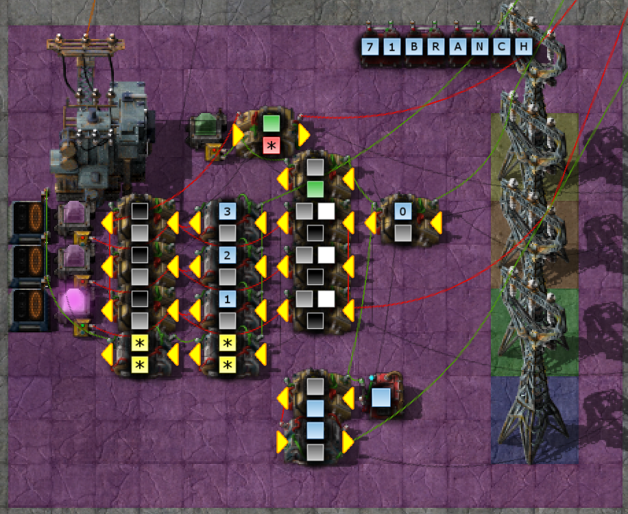

  Returns PC+1 to Rd.sd. Compares R1.s1 to R2.s2, and makes the following jumps:

  * `=` PC+rOp.1
  * `<` PC+rOp.2
  * `>` PC+rOp.3

#### 72: Exec
  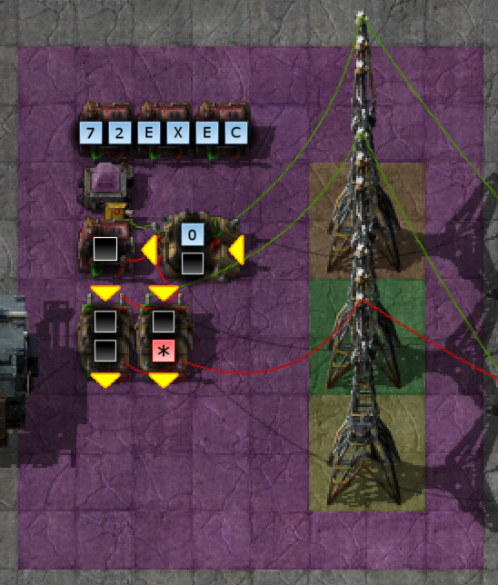

  Execute the contents of R1 as an instruction, at the current PC value.

#### 80: Wire
  Write a packet to a two-wire network, and clear the receive registers for a response. To leave either wire untouched, select `rNull` for it. `rRed` and `rGreen` are cleared on the same frame the selected signals are transmitted. Write `rNull` to both wires to clear the receive buffer without transmitting anything.
  * R1=>Red Wire
  * R2=>Green Wire
  * 0=>rRed,rGreen

#### 81-82: Memory
  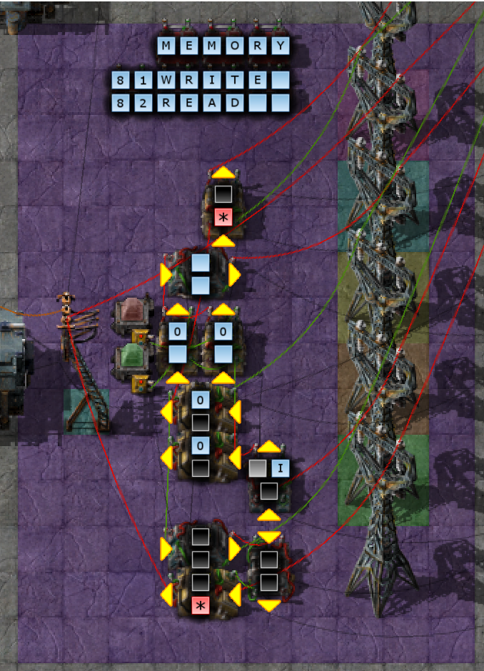
  * 81: Write
    * Write the contents of R2 to the memory location or memory-mapped device selected by R1.s1. If `signal-I` is set, the memory access is offset from the selected pointer. If Rd is set, the value previously in that memory address will be returned.
      * [R1.s1+I] -> Rd
      * R2 -> [R1.s1+I]

  * 82: Read
    * Read the memory location or memory-mapped device selected by R1.s1 into Rd. If `signal-I` is set, the memery access is offset from the selected pointer.
      * [R1.s1+I] -> Rd

#### 83-84: Stacks
  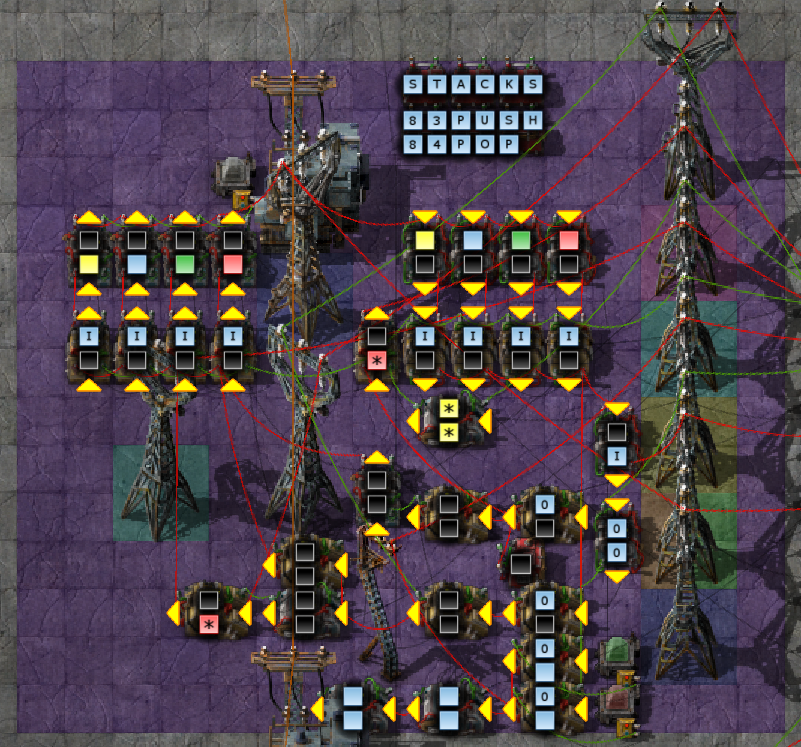

  This block implements the frame pointer value on Scalar `signal-I` for use by other instructions.

  * 83: Push
    * Store a frame to one of the stacks in rIndex, as selected by `signal-I`.
      * R2 -> [rIndex.stack-1]
      * rIndex.stack--
  * 84: Pop
    * Retrieve a frame to one of the stacks in rIndex, as selected by `signal-I`.
      * [rIndex.stack] -> Rd
      * rIndex.stack++
    * As a special case, the stack pointer will not be incremented if Rd is rIndex.

#### 85: Append (not yet implemented)
  Store a frame to an array in one of the index pointers.

  * R2 -> [rIndex.stack++]

#### 100: Player Info (Optional)
  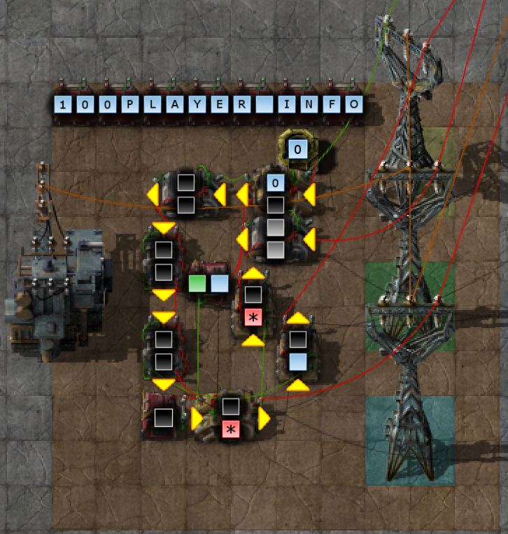
  This instruction uses my Player Combinator mod to read player information.

  If R1.S1 == 0, a `playercounts` frame is returned containing the number players total, and online.

  If R1.S1 >0, then it returns a `playerinfo` frame, with the players name, and their online/admin status.

### 101: Construction Orders (Optional)
  
  Issue an order in R1 to a ConMan, with data in R2. If ConMan returns any data on CC2, it will be sent to Rd

### 102: Map Scanning (Optional)

  Scan the position or area selected by the command in R1, and send result to Rd.
